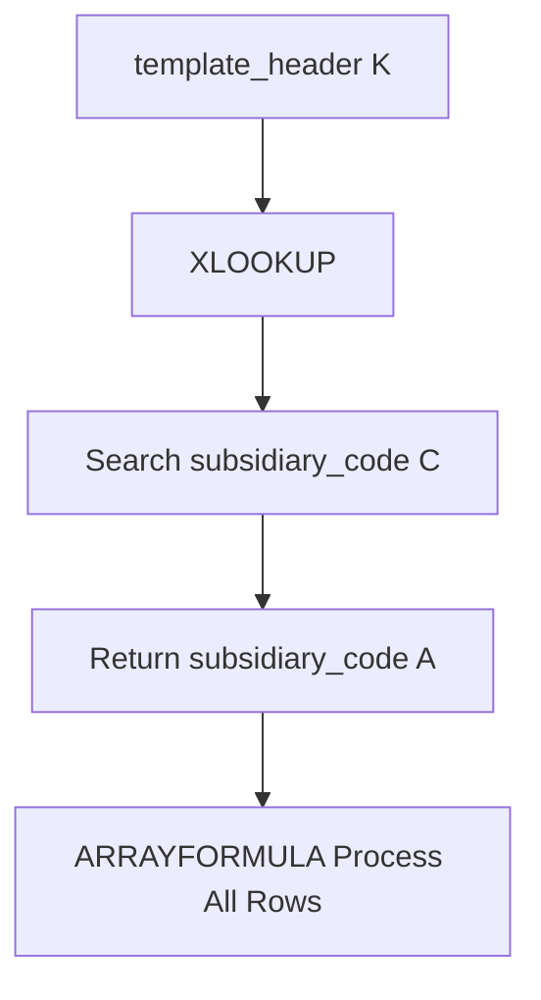

# ARRAYFORMULA XLOOKUP Subsidiary Code

## Formula

```gs id="u8xa2m"
=ARRAYFORMULA(
XLOOKUP(
template_header!$K$2:$K,
subsidiary_code!$C$2:$C,
subsidiary_code!$A$2:$A,
""
))
````

## Description

This formula is used to automatically perform data lookup operations based on specific codes using `XLOOKUP`, then process all rows dynamically using `ARRAYFORMULA`.

The formula will:

* Retrieve values from column `K` in the `template_header` sheet
* Search those values in column `C` of the `subsidiary_code` sheet
* If found:

  * Return the corresponding value from column `A`
* If not found:

  * Return an empty string (`""`)

This formula is commonly used for:

* Subsidiary code mapping
* Code-to-name conversion
* Cross-sheet relationships
* Master data lookup
* Spreadsheet automation

---

# Formula Structure



---

# Formula Explanation

## 1. ARRAYFORMULA

```gs id="m8dk2y"
ARRAYFORMULA(...)
```

Used to automatically process the formula across an entire range without manually dragging the formula downward.

### Main Functions

* Process multiple rows simultaneously
* Reduce per-cell formula usage
* Improve spreadsheet efficiency

---

## 2. XLOOKUP

```gs id="z4nc8v"
XLOOKUP(
template_header!$K$2:$K,
subsidiary_code!$C$2:$C,
subsidiary_code!$A$2:$A,
""
)
```

Used to search for a specific value within a range and return a related value from another column.

---

## XLOOKUP Parameters

| Parameter                 | Description                |
| ------------------------- | -------------------------- |
| `template_header!$K$2:$K` | Lookup value               |
| `subsidiary_code!$C$2:$C` | Lookup reference column    |
| `subsidiary_code!$A$2:$A` | Return result column       |
| `""`                      | Default value if not found |

---

# Formula Workflow

```text id="g2lf9r"
Retrieve data from template_header!K
        ↓
Search data in subsidiary_code!C
        ↓
If found
        ↓
Return value from subsidiary_code!A
        ↓
If not found
        ↓
Return empty value
```

---

# Example Data

## template_header Sheet

| K      |
| ------ |
| SUB-01 |
| SUB-02 |
| SUB-99 |

---

## subsidiary_code Sheet

| A       | C      |
| ------- | ------ |
| Jakarta | SUB-01 |
| Bandung | SUB-02 |

---

# Formula Result

| Result    |
| --------- |
| Jakarta   |
| Bandung   |
| *(empty)* |

---

# Conclusion

This formula is used to automatically perform master data lookups across sheets using a combination of `ARRAYFORMULA` and `XLOOKUP`.

Advantages of this approach:

* Automatically processes all rows
* Easy to maintain
* More scalable for large spreadsheets
* Reduces manual mapping errors
