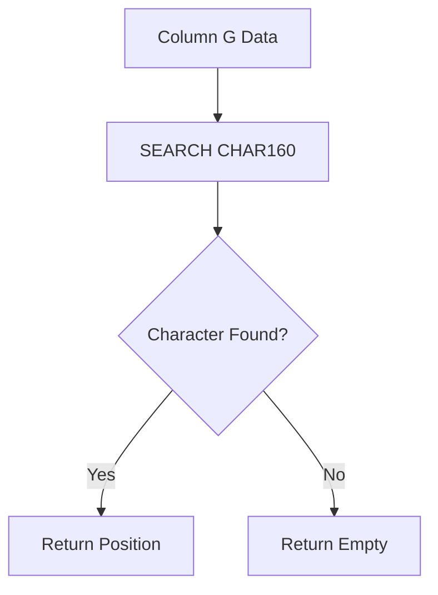

# SEARCH CHAR(160)

## Formula

```gs id="m4qt8y"
=ARRAYFORMULA(
IF(
A2:A<>"",
IFERROR(
SEARCH(CHAR(160), G2:G),
""
),
""
))
````


## Description

This formula is used to detect hidden characters known as **non-breaking spaces** in Google Sheets data.

The `CHAR(160)` character commonly appears from:

* Website copy-paste
* System-exported data
* HTML content
* CSV imports
* Third-party application data

Although it visually looks like a normal space, it is different from a regular space (`CHAR(32)`).

The formula will:

* Search for `CHAR(160)` in column `G`
* If found:

  * Return the character position
* If not found:

  * Return an empty string (`""`)

This formula is highly useful for:

* Data cleaning
* Import validation
* Hidden character detection
* Text normalization
* Troubleshooting failed lookup formulas

---

# Formula Structure



---

# Formula Explanation

## 1. SEARCH

```gs id="f7mk2q"
SEARCH(CHAR(160), G2:G)
```

Used to search for the position of a specific character within text.

In this formula:

* `SEARCH` looks for the `CHAR(160)` character
* The search is performed across column `G`

If the character is found:

* The formula returns its numeric position

Example:

| Data          | Result |
| ------------- | ------ |
| `Hello World` | `6`    |

Because the `CHAR(160)` character is located at position 6.

---

## 2. CHAR(160)

```gs id="y6pc8m"
CHAR(160)
```

`CHAR(160)` represents a **non-breaking space** character.

This character:

* Looks like a normal space
* Is visually invisible
* Commonly causes:

  * `VLOOKUP` failures
  * `XLOOKUP` mismatches
  * `QUERY` errors
  * String comparison mismatches

---

## 3. IFERROR

```gs id="r5tw1n"
IFERROR(SEARCH(...), "")
```

Used to handle errors when the character is not found.

Without `IFERROR`, the result would become:

```text id="v3zx8k"
#VALUE!
```

With `IFERROR`, the result becomes empty, making the spreadsheet cleaner and easier to read.

---

# Formula Workflow

```text id="h7qm2r"
Retrieve data from column G
        ↓
Search for CHAR(160)
        ↓
If found
        ↓
Return character position
        ↓
If not found
        ↓
Return empty value
```

---

# Example Data

| G           |
| ----------- |
| Hello World |
| Hello World |
| Normal Data |

---

# Formula Result

| Result    |
| --------- |
| *(empty)* |
| 6         |
| *(empty)* |

---

# Conclusion

This formula is used to detect hidden `CHAR(160)` characters that often cause issues during lookup, filtering, and data validation processes.

Highly suitable for:

* Imported data cleaning
* Text validation
* Spreadsheet data normalization
* Hidden character troubleshooting
