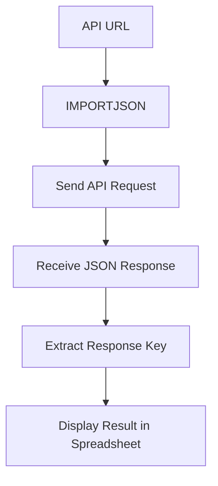

# IMPORTJSON Custom Function

## Formula

```gs id="p7xt4m"
=IMPORTJSON(address, Keyrespons)
```

## Description

`IMPORTJSON` is a custom function in Google Sheets used to retrieve JSON data from APIs or URLs and display it directly inside a spreadsheet.

This function is not built into Google Sheets and is usually created using:

- Google Apps Script
- External script libraries
- Custom integrations

This formula is commonly used for:

- REST API integration
- Retrieving realtime data
- Monitoring dashboards
- External data synchronization
- Reporting automation

---

# Formula Structure



---

# Parameter Explanation

## 1. api_address

```gs id="w6pk3r"
api_address;
```

Contains the API endpoint URL to be requested.

Example:

```text id="e2rq7n"
https://api.example.com/users
```

Purpose of this parameter:

- Defines the data source
- Sends requests to the API server
- Retrieves JSON responses

---

## 2. Keyrespons

```gs id="k7vm2x"
Keyrespons;
```

Used to specify the JSON key or path to retrieve from the API response.

Example JSON response:

```json id="h3pw9m"
{
  "name": "Akmad",
  "email": "akmad@mail.com"
}
```

Example usage:

```gs id="f8zn4q"
=IMPORTJSON(api_url, "name")
```

Result:

```text id="m2rx8p"
Akmad
```

If you want to get all data response used:

Example JSON response:

```json id="h3pw9m"
{
  "data": {
    "name": "Akmad",
    "email": "akmad@mail.com"
  }
}
```
Example usage:

```gs id="f8zn4qx"
=IMPORTJSON(api_url, "data")
```

Result:

| name  | email   |
| ----  | --- |
| akmad | akmad@mail.com  |
| hamsyani | hamsyani@mail.com  |
| nudin  | nudin@mail.com |


---

# Formula Workflow

```text id="y5vk9n"
Send request to API
        ↓
Receive JSON response
        ↓
Search requested key
        ↓
Retrieve key value
        ↓
Display result in spreadsheet
```

---

# Example Usage

## Formula

```gs id="r9xt3m"
=IMPORTJSON(
"https://api.example.com/users",
"name"
)
```

---

## API Response

```json id="u4pk7z"
{
  "name": "Akmad",
  "role": "Backend Developer"
}
```

---

## Result

| name  |
| ----- |
| Akmad |

---

# Use Cases

This formula is commonly used for:

- API monitoring dashboards
- Realtime tracking data
- ERP integration
- Inventory system integration
- Automatic external data display
- JSON data fetching

---

# Notes

Since `IMPORTJSON` is a custom function:

- Requires Google Apps Script
- May be affected by API quota limits
- Requires internet access
- Depends on the API JSON structure

---

# Conclusion

`IMPORTJSON` is used to retrieve JSON data directly from APIs into Google Sheets using a custom function.

Highly suitable for:

- API integration
- Data automation
- Realtime spreadsheets
- Monitoring dashboards
- External system integration
