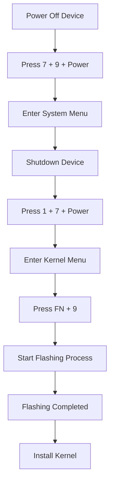

# Flash Firmware Chiperlab

Flash Firmware Chiperlab is the process of updating or reinstalling the operating system on Chiperlab barcode scanner terminals and mobile computer devices. This process is performed to improve device performance, fix system bugs, and ensure compatibility with the latest applications.

Through firmware flashing, the device can be restored to a stable condition when experiencing system errors such as boot loops, freezes, application failures, or software corruption. Firmware updates also help improve device security and optimize hardware functionality, including the barcode scanner, touchscreen, Wi-Fi connectivity, and data communication features.

Common Flash Firmware Chiperlab services include:

- Official firmware reinstallation
- System version upgrades
- Boot failure recovery
- System error unlocking
- Software-bricked device recovery
- Device performance optimization

## Download Required Tools

- Chiperlab Driver for Windows  
  [Download Here](https://drive.google.com/file/d/1N-9qJW6OMTJN8w6vXC8KT44bqfq29Ulz/view?usp=sharing)

- Chiperlab Forge Tool  
  [Download Here](https://drive.google.com/file/d/1Kt2pgaTtyHzdvPWybJPLXI7dwe6p7aor/view?usp=sharing)

- Flashing Software  
  [Download Here](https://drive.google.com/file/d/1Q6y-DcIwlXO6x_k22oGCasGV6UPP0cbg/view?usp=sharing)

- Firmware, Boot, and Kernel Package  
  [Download Here](https://drive.google.com/file/d/1Jy_ZPHn6dbTATGqCJumiBzzHyzN2WD0-/view?usp=sharing)

- Setup Module  
  [Download Here](https://drive.google.com/file/d/1qdYh05xsmMGjOtZdUgn0ytbjXE5iJr2g/view?usp=sharing)

## Flashing Procedure

Before starting the flashing process, ensure that:

- The device battery is sufficiently charged.
- The USB driver has been installed correctly.
- All firmware and flashing tools have been downloaded.
- The USB cable connection is stable.

### Flashing Steps

1. Power off the device completely by pressing the **Power** button.

2. Turn on the device while pressing the following key combination simultaneously:

   ```text
   7 + 9 + Power
   ````

3. Once the **System Menu** appears, press the **Power** button again until the device shuts down.

4. Turn the device back on while pressing:

   ```text
   1 + 7 + Power
   ```

5. In the **Kernel Menu**, press:

   ```text
   FN + 9
   ```

6. The firmware flashing process will start automatically.

7. Wait until the flashing process is completed successfully.

8. Continue by installing the required kernel package.

## Flashing Workflow



## Notes

* Interrupting the firmware installation may cause system corruption.
* Always use firmware versions that match the Chiperlab device model.
* It is recommended to back up important data before performing firmware updates.
