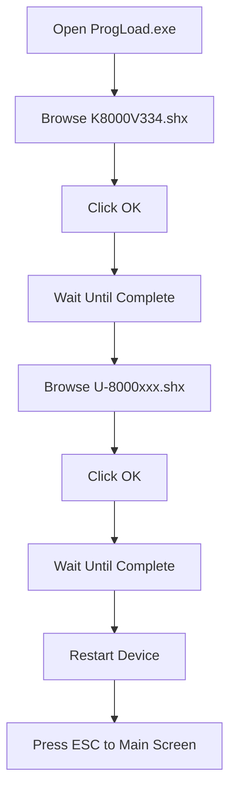

import Admonition from "@theme/Admonition";

# Boot

Boot mode is a method used to start the device into a special download mode for firmware flashing and system recovery processes. This mode is typically used when the device experiences bootloops, gets stuck on the logo screen, or fails to enter the normal operating system.

Using MD mode, the device can connect to a computer so the firmware can be directly reinstalled into the device memory.

## Installation Steps

Make sure you have already downloaded the required tools mentioned in the flashing article.

### Boot Installation Flow

```mermaid id="q7xa9m"
flowchart TD

A[Turn Off Device] --> B["Press 1 + 7 + Power"]
B --> C[Select Load Program]
C --> D[Choose Connection Type]
D --> E[Select Cradle-IR]
E --> F[Set Baud Rate 115200]
F --> G[Insert Device into USB Docking]
G --> H[Open ProgLoad.exe]
H --> I[Load B8000V423.shx]
I --> J[Click OK]
J --> K[Wait Until Download Complete]
````

1. Turn off and restart the device by pressing the following key combination:

   ```text id="t4zp8n"
   1 + 7 + Power
   ```

2. Select **Load Program**

3. Choose the network connection type:

   ```text id="y3nm5q"
   IrDA or Cradle-IR
   ```

4. In this guide, use:

   ```text id="v8xr1a"
   Cradle-IR
   ```

5. Select the baud rate:

```text id="c2kw6s"
115200
```

6. Insert the Chiperlab U-8000 device into the USB docking station.

7. Open the software:

   ```text id="n7up4l"
   ProgLoad.exe
   ```

<Admonition type="info">
This software is included in the Firmware, Boot, and Kernel Package folder downloaded earlier.
</Admonition>

8. Configure the settings in `ProgLoad.exe`

* **Command Type** → Cradle-IR
* **Com Port** → Adjust according to Device Manager
* **Baud Rate** → 115200 bps or according to the device specification
* **File Type** → `.SHX`
* **Browse** → Select the `B8000V423.shx` file
* **Click OK**

9. Wait until the download progress is complete.

# Kernel & Firmware

Still using the program:

```text id="m4rq7w"
ProgLoad.exe
```

## ProgLoad.exe Configuration

* **Command Type** → Cradle-IR
* **Com Port** → Adjust according to Device Manager
* **Baud Rate** → 115200 bps or according to the device specification
* **File Type** → `.SHX`

### Installation Flow



* **Browse** → Select `K8000V334.shx`
* **OK** → Wait until complete, then repeat
* **Browse** → Select `U-8000xxx.shx`
* **OK** → Wait until complete, then turn off and restart the device
* **ESC** → Press `ESC` to return to the main screen

## Notes

<Admonition type="warning">
Make sure the device is stably connected to the docking station. Before clicking OK, ensure that "Load Program" has already been selected on the Chiperlab device. Do not wait too long because the connection request has a timeout limit of around 5–10 seconds. If it times out, repeat the process again.
</Admonition>

Next, we will continue to the module installation process.
