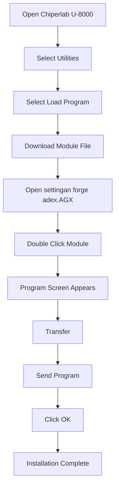

# Module

A module is a configuration package for the Chiperlab device that enables automatic Enter input after scanning a barcode, so users do not need to manually input quantity first.

# Module Installation

> Before performing this process, make sure the following software has already been installed on your computer.

```text id="p6ya3f"
Forge Batch 8 Series Install_2.02.0007.exe
````

## Installation Flow



1. On the Chiperlab U-8000 device, select:

```text id="m3zt7q"
Utilities
```

2. Select:

```text id="v7nf2k"
Load Program
```

3. Open the module file. Make sure the module has already been downloaded.

Module filename:

```text id="t9xr4w"
settingan forge adex.AGX
```

4. Double-click the module file.

5. Wait until the program screen appears.

6. Select:

```text id="r2kd8p"
Transfer → Send Program
```

7. Click **OK** and wait until the installation process is complete.
