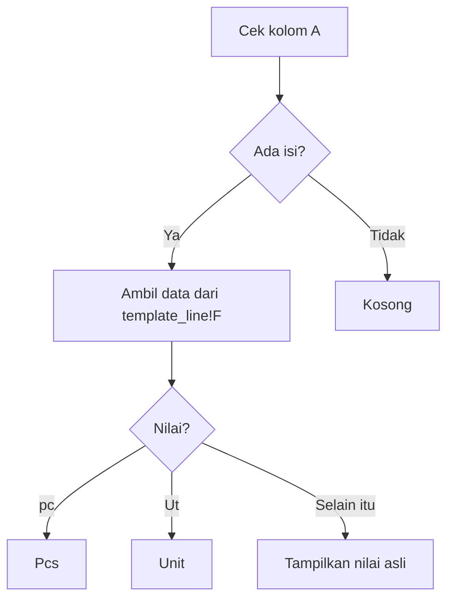

## Description

>This formula is used to automatically convert values from one column into specific labels based on the data contained in the `template_line` sheet.

The formula will:

- Check whether column `A` contains data.
- If it contains data:
  - Convert `"pc"` into `"Pcs"`
  - Convert `"Ut"` into `"Unit"`
  - Otherwise, display the original value.

- If column `A` is empty, the result will also be empty.

## Formula

```gs
=ARRAYFORMULA(
IF( A2:A<>"",
SWITCH(
    template_line!F2:F,
     "pc","Pcs",
     "Ut","Unit",
     template_line!F2:F
),"" )
)
````

## Explanation of the Code

## 1. ARRAYFORMULA

```gs
ARRAYFORMULA(...)
```

Used to make the formula run automatically for all rows without needing to drag the formula downward manually.

Example:

| A    | F   |
| ---- | --- |
| Data | pc  |
| Data | Ut  |
| Data | Box |

The results are automatically processed for all rows at once.

---

## 2. IF

```text
IF(A2:A<>"")
```

```gs
IF(A2:A<>"", ..., "")
```

Used to check whether column `A` contains data.

### If

- Column `A` contains data → execute the `SWITCH` process
- Column `A` is empty → return an empty result (`""`)

The purpose is to prevent the formula from generating values on empty rows.

## 3. SWITCH

```gs
SWITCH(
template_line!F2:F,
"pc","Pcs",
"Ut","Unit",
template_line!F2:F
)
```

Used to replace specific values.

### Mapping Performed

| Original Value | Result         |
| -------------- | -------------- |
| pc             | Pcs            |
| Ut             | Unit           |
| others         | original value |

### Formula Workflow



## Example Result

### Original Data

| A | template_line!F |
| - | --------------- |
| 1 | pc              |
| 1 | Ut              |
| 1 | Box             |
|   | pc              |

### Formula Result

| Result    |
| --------- |
| Pcs       |
| Unit      |
| Box       |
| *(empty)* |

## Conclusion

This formula is used for:

- Automating all rows using `ARRAYFORMULA`
- Validating empty rows using `IF`
- Converting specific text values using `SWITCH`

It is highly suitable for:

- Unit normalization
- Code mapping
- Automatic label formatting in large spreadsheets
