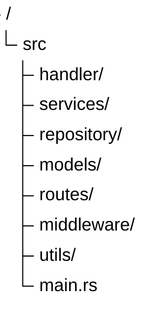

## Description

> Axum is an asynchronous web framework for Rust built on top of the Tokio and Hyper ecosystem.
> Axum is designed for building REST APIs and backend services with high performance, strong type safety, and a modular architecture.

This framework is commonly used for:

- REST API
- Authentication service
- Realtime service
- Microservice
- Backend application

## Advantages of Axum

- Built-in async/await
- Type-safe routing
- Middleware support
- Flexible extractor system
- Strong Tokio integration
- Suitable for high concurrency applications

## Installation

Add the following dependencies to `Cargo.toml`:

```toml
[dependencies]
axum = "0.8"
tokio = { version = "1", features = ["full"] }
````

## Basic Routing

Example of a simple API using Axum:

```rust
use axum::{
    routing::get,
    Router,
};

async fn root() -> &'static str {
    "Hello Axum"
}

#[tokio::main]
async fn main() {
    let app = Router::new()
        .route("/", get(root));

    let listener = tokio::net::TcpListener::bind("0.0.0.0:3000")
        .await
        .unwrap();

    axum::serve(listener, app)
        .await
        .unwrap();
}
```

### Running the Project

```bash
cargo run
```

### Server Address

```bash
localhost:3000
```

## Axum Backend Structure

Generally, Axum projects are separated into several layers:



## Axum uses Tokio as its asynchronous runtime.

With Tokio, Axum can handle many concurrent requests without creating a new thread for every request.

This makes Axum highly suitable for:

* High traffic APIs
* WebSocket
* Realtime notifications
* Background tasks
* Concurrent processing

## Use Cases

Axum is suitable for building:

* Inventory systems
* POS backends
* Payment gateways
* Authentication APIs
* ERP backends
* Realtime dashboards
* WebSocket services

Because of its high performance and strong type safety, Axum has become one of the increasingly popular modern backend frameworks in the Rust ecosystem.

> Source code: [Axum Documentation](https://docs.rs/axum/latest/axum/?utm_source=chatgpt.com)

