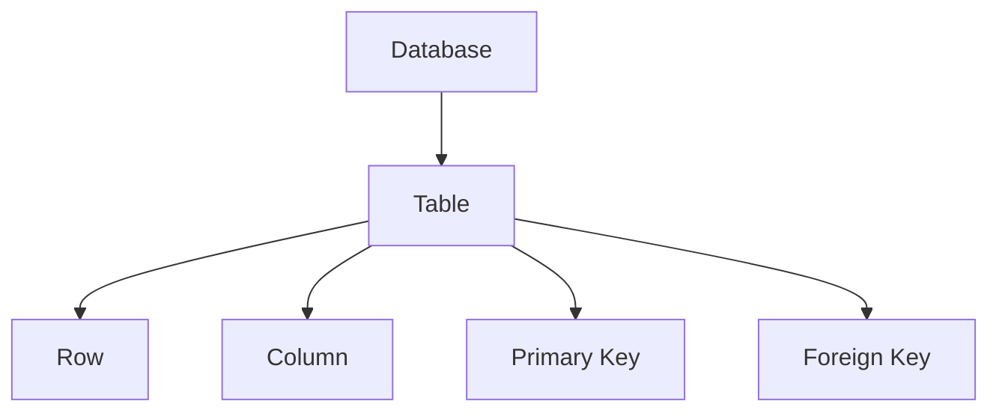

import useBaseUrl from '@docusaurus/useBaseUrl';
import Admonition from "@theme/Admonition";

<center>
  
</center>

# Introduction to SQL

SQL (*Structured Query Language*) is a standard language used to manage and manipulate relational databases. With SQL, we can perform various operations such as reading data, inserting data, updating data, and deleting data from a database.

## Why Learn SQL?

SQL is used in almost every modern system, such as:

- POS (Point of Sale) applications
- Banking systems
- Marketplaces
- Analytics dashboards
- Backend APIs
- Inventory and warehouse systems

Understanding SQL is an essential foundation for backend developers, data analysts, and software engineers.

## Main SQL Functions

Some of the main SQL commands include:

| Command  | Function                 |
| -------- | ------------------------ |
| `SELECT` | Retrieve data            |
| `INSERT` | Add data                 |
| `UPDATE` | Modify data              |
| `DELETE` | Remove data              |
| `CREATE` | Create table/database    |
| `ALTER`  | Modify table structure   |
| `DROP`   | Delete table/database    |

## SQL Query Examples

### Retrieving Data

```sql id="p4tm9a"
SELECT * FROM users;
````

### Inserting Data

```sql id="y7fv2r"
INSERT INTO users (name, email)
VALUES ('Akmad', 'akmad@mail.com');
```

### Updating Data

```sql id="v9dx1l"
UPDATE users
SET name = 'Nudin'
WHERE id = 1;
```

### Deleting Data

```sql id="m5ck7s"
DELETE FROM users
WHERE id = 1;
```

<Admonition type="warning">
Be careful when using DELETE without a WHERE clause. It may remove all data in a table.
</Admonition>

## Relational Database Structure

A relational database consists of several components:



### Components

* **Database** → Main storage container
* **Table** → Collection of data
* **Row** → A single record of data
* **Column** → Data field structure
* **Primary Key** → Unique identifier for data
* **Foreign Key** → Relationship between tables

## Conclusion

SQL is a fundamental skill that should be understood in modern software development. By learning SQL, we can manage data efficiently, quickly, and in a structured way.

Additional notes will be created in each module according to tasks needed in a working environment.
