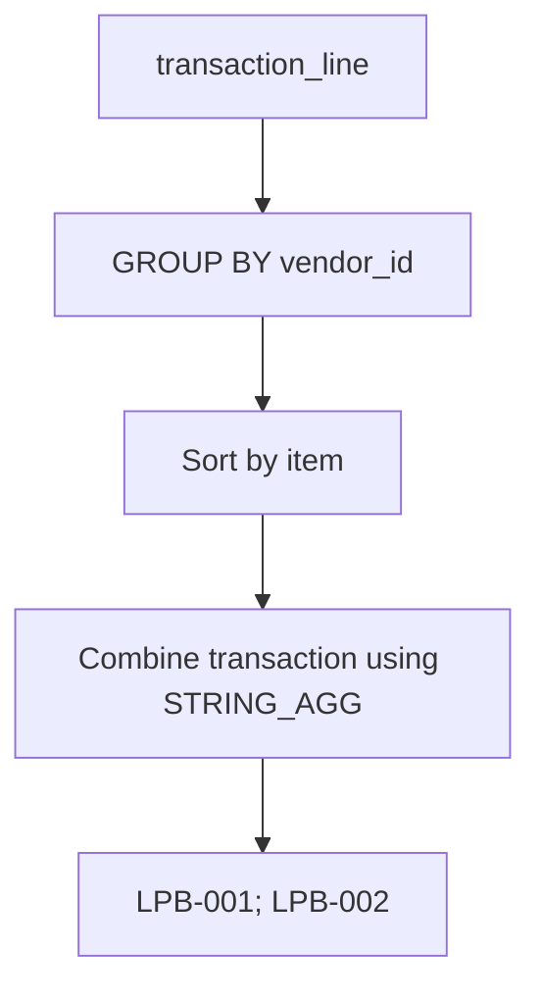

> Used to combine multiple rows into a single string.

# Example

| item | transaction |
| ---- | ----------- |
| 3    | 1003        |
| 1    | 1001        |
| 2    | 1002        |

## Query

```sql
SELECT
    tl.vendor_id,
    STRING_AGG(t.tranid::text, '; ' ORDER BY tl.item) AS lpb
FROM transaction_line tl
JOIN transactions t
    ON t.id = tl.transaction
GROUP BY tl.vendor_id;
````

## Result

| vendor_id | lpb              |
| --------- | ---------------- |
| 1         | LPB-001; LPB-002 |
| 2         | LPB-010; LPB-011 |

# Aggregation Flow



# Explanation

The query works by:

1. Joining `transaction_line` with `transactions`
2. Grouping data by `vendor_id`
3. Sorting rows using `ORDER BY tl.item`
4. Combining all transaction IDs into one string using `STRING_AGG`

# SQL Equivalent Functions

| Database   | Function         |
| ---------- | ---------------- |
| PostgreSQL | `STRING_AGG()`   |
| Oracle     | `LISTAGG()`      |
| MySQL      | `GROUP_CONCAT()` |
| SQL Server | `STRING_AGG()`   |
