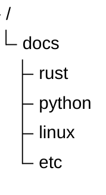

<center>

</center>

## Buku Documentation Saya

Dokumentasi ini dibuat sebagai pusat catatan kerja, pembelajaran, serta referensi penggunaan aplikasi dan teknologi yang digunakan sehari-hari.

Isi dokumentasi disusun seperti buku catatan digital yang terstruktur, sehingga memudahkan pencarian materi, langkah kerja, konfigurasi aplikasi, hingga implementasi source code.

## Tujuan Dokumentasi

Beberapa tujuan utama dari dokumentasi ini:

- Menyimpan catatan teknis pekerjaan
- Mendokumentasikan proses development
- Menyimpan konfigurasi aplikasi dan server
- Menyimpan tutorial internal
- Menjadi referensi penggunaan framework dan library
- Menyusun materi pembelajaran secara terstruktur
- Menyimpan troubleshooting dan solusi error

## Struktur Dokumentasi

Dokumentasi dibagi berdasarkan kategori teknologi atau kebutuhan kerja.

Contoh struktur:



Setiap folder merepresentasikan modul atau topik tertentu.

## Isi Dokumentasi

Beberapa jenis dokumentasi yang disimpan:

### Catatan Development

* Struktur project
* Standar coding
* Implementasi fitur
* Integrasi API
* Database design

### Penggunaan Aplikasi

* Cara instalasi
* Konfigurasi aplikasi
* Deployment
* User guide internal

### Infrastruktur & Server

* Setup Linux server
* Docker container
* Reverse proxy
* SSL configuration
* Monitoring server

### Pembelajaran Teknologi

* Rust
* Python
* CodeIgniter
* JavaScript
* Database
* DevOps

## Format Penulisan

Dokumentasi menggunakan format Markdown (`.md`) agar:

* Mudah ditulis
* Mudah dibaca
* Ringan
* Versioning dengan Git
* Mendukung code block
* Mendukung gambar dan tabel

Contoh code block:

```rust
fn main() {
    println!("Hello World");
}
```

## Penggunaan Dokumentasi

Dokumentasi ini digunakan sebagai:

* Referensi kerja harian
* Knowledge base pribadi
* Dokumentasi project
* Catatan troubleshooting
* Arsip implementasi sistem

## Versioning

Seluruh dokumentasi tersimpan dalam repository Git sehingga perubahan dapat dilacak dan dikelola dengan baik.

## Penutup

Dokumentasi yang baik membantu menjaga konsistensi pekerjaan, mempercepat troubleshooting, dan memudahkan proses pembelajaran maupun maintenance project di masa depan.dan Dokumentasi ini dibangun dengan [Docusaurus](https://docusaurus.io/)

