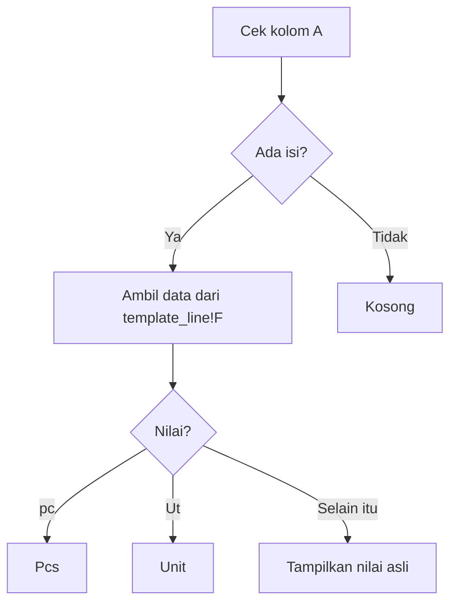

## Description

> Rumus ini digunakan untuk melakukan konversi otomatis nilai satu kolom menjadi label tertentu berdasarkan isi data pada sheet `template_line`.

Rumus akan:

- Mengecek apakah kolom `A` memiliki isi.
- Jika ada isi:
  - Mengubah `"pc"` menjadi `"Pcs"`
  - Mengubah `"Ut"` menjadi `"Unit"`
  - Selain itu, menampilkan nilai aslinya.

- Jika kolom `A` kosong, hasil juga kosong.

## Rumus

```gs
=ARRAYFORMULA(
IF( A2:A<>"",
SWITCH(
    template_line!F2:F,
     "pc","Pcs",
     "Ut","Unit",
     template_line!F2:F
),"" )
)
```

## Maksud Dari Code

## 1. ARRAYFORMULA

```gs
ARRAYFORMULA(...)
```

Digunakan agar rumus berjalan otomatis untuk seluruh baris tanpa perlu drag formula ke bawah.

Contoh:

| A    | F   |
| ---- | --- |
| Data | pc  |
| Data | Ut  |
| Data | Box |

Hasil langsung diproses semua baris sekaligus.

---

## 2. IF

```text
IF(A2:A<>"")
```

```gs
IF(A2:A<>"", ..., "")
```

Berfungsi untuk mengecek apakah kolom `A` memiliki isi.

### Jika

- Kolom `A` terisi → jalankan proses `SWITCH`
- Kolom `A` kosong → hasil kosong (`""`)

Tujuannya agar formula tidak menghasilkan data pada baris kosong.

## 3. SWITCH

```gs
SWITCH(
template_line!F2:F,
"pc","Pcs",
"Ut","Unit",
template_line!F2:F
)
```

Digunakan untuk mengganti nilai tertentu.

### Mapping yang dilakukan

| Nilai Asli | Hasil      |
| ---------- | ---------- |
| pc         | Pcs        |
| Ut         | Unit       |
| selain itu | nilai asli |

### Alur Kerja Rumus



## Contoh Hasil

### Data Awal

| A   | template_line!F |
| --- | --------------- |
| 1   | pc              |
| 1   | Ut              |
| 1   | Box             |
|     | pc              |

### Hasil Formula

| Hasil      |
| ---------- |
| Pcs        |
| Unit       |
| Box        |
| _(kosong)_ |

## Kesimpulan

Rumus ini dipakai untuk:

- Otomatisasi seluruh baris menggunakan `ARRAYFORMULA`
- Validasi baris kosong menggunakan `IF`
- Konversi teks tertentu menggunakan `SWITCH`

Sangat cocok digunakan untuk:

- Normalisasi satuan
- Mapping kode
- Format label otomatis pada spreadsheet besar
