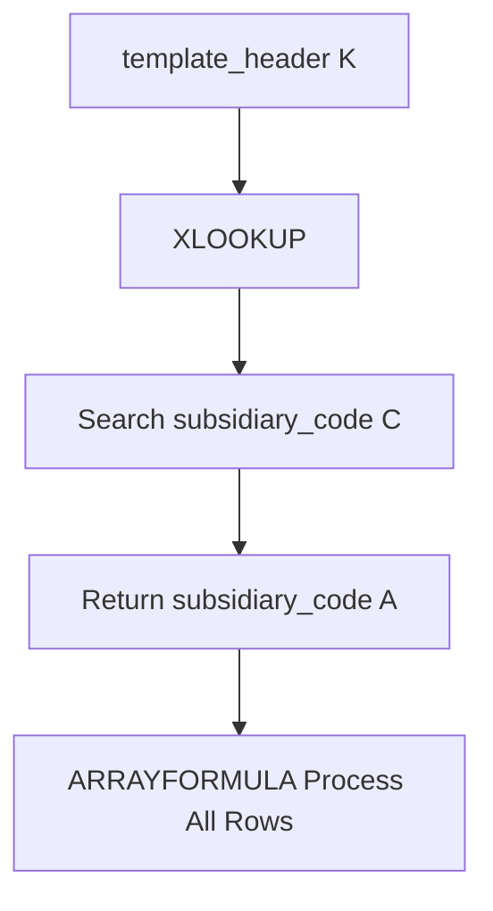

# ARRAYFORMULA XLOOKUP Subsidiary Code

## Formula

```gs id="u8xa2m"
=ARRAYFORMULA(
XLOOKUP(
template_header!$K$2:$K,
subsidiary_code!$C$2:$C,
subsidiary_code!$A$2:$A,
""
))
````


## Deskripsi

Formula ini digunakan untuk melakukan pencarian data otomatis berdasarkan kode tertentu menggunakan `XLOOKUP`, kemudian diproses ke seluruh baris menggunakan `ARRAYFORMULA`.

Formula akan:

* Mengambil nilai dari kolom `K` pada sheet `template_header`
* Mencari nilai tersebut pada kolom `C` sheet `subsidiary_code`
* Jika ditemukan:

  * Mengembalikan nilai dari kolom `A`
* Jika tidak ditemukan:

  * Menghasilkan string kosong (`""`)

Formula ini sangat umum digunakan untuk:

* Mapping kode subsidiary
* Konversi kode ke nama
* Relasi antar sheet
* Lookup master data
* Otomatisasi data spreadsheet


# Struktur Formula




# Penjelasan Formula

## 1. ARRAYFORMULA

```gs id="f3rx8k"
ARRAYFORMULA(...)
```

Digunakan agar formula dapat berjalan otomatis untuk seluruh range tanpa perlu drag formula ke bawah secara manual.

### Fungsi utama

* Memproses banyak baris sekaligus
* Mengurangi penggunaan formula per-cell
* Membuat spreadsheet lebih efisien

---

## 2. XLOOKUP

```gs id="e9yv6p"
XLOOKUP(
template_header!$K$2:$K,
subsidiary_code!$C$2:$C,
subsidiary_code!$A$2:$A,
""
)
```

Digunakan untuk mencari nilai tertentu pada suatu range dan mengembalikan hasil dari kolom lain.

---

## Parameter XLOOKUP

| Parameter                 | Penjelasan                              |
| ------------------------- | --------------------------------------- |
| `template_header!$K$2:$K` | Nilai yang dicari                       |
| `subsidiary_code!$C$2:$C` | Kolom referensi pencarian               |
| `subsidiary_code!$A$2:$A` | Nilai hasil yang dikembalikan           |
| `""`                      | Nilai default jika data tidak ditemukan |

---

# Alur Kerja Formula

```text id="w7ph2n"
Ambil data dari template_header!K
        ↓
Cari data pada subsidiary_code!C
        ↓
Jika ditemukan
        ↓
Tampilkan nilai dari subsidiary_code!A
        ↓
Jika tidak ditemukan
        ↓
Tampilkan kosong
```

---

# Contoh Data

## Sheet template_header

| K      |
| ------ |
| SUB-01 |
| SUB-02 |
| SUB-99 |

---

## Sheet subsidiary_code

| A       | C      |
| ------- | ------ |
| Jakarta | SUB-01 |
| Bandung | SUB-02 |

---

# Hasil Formula

| Result     |
| ---------- |
| Jakarta    |
| Bandung    |
| *(kosong)* |

---

# Kesimpulan

Formula ini digunakan untuk melakukan lookup data master secara otomatis antar sheet menggunakan kombinasi `ARRAYFORMULA` dan `XLOOKUP`.

Kelebihan pendekatan ini:

* Otomatis untuk seluruh baris
* Mudah dipelihara
* Lebih scalable untuk spreadsheet besar
* Mengurangi error manual mapping
