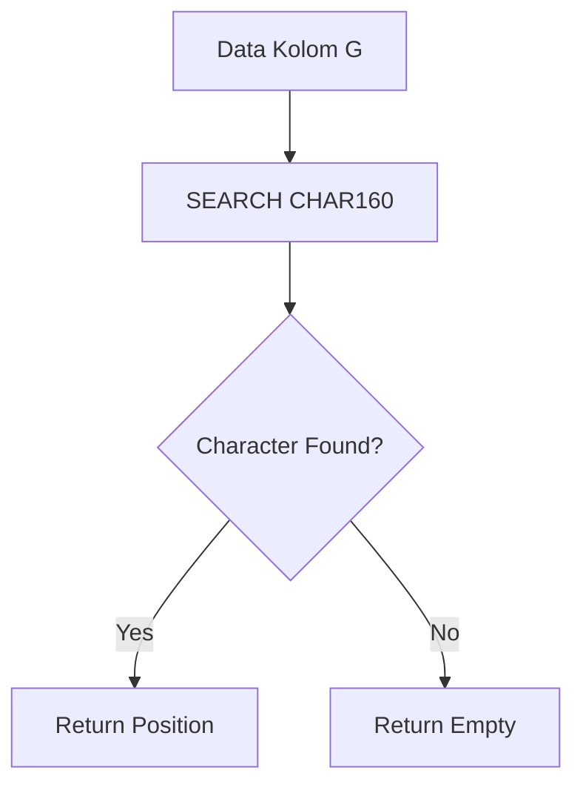

# SEARCH CHAR(160)

## Formula

```gs id="m4qt8y"
=ARRAYFORMULA(
IF(
A2:A<>"",
IFERROR(
SEARCH(CHAR(160), G2:G),
""
),
""
))
````


## Deskripsi

Formula ini digunakan untuk mendeteksi karakter tersembunyi berupa **non-breaking space** pada data di Google Sheets.

Karakter `CHAR(160)` sering muncul dari:

* Copy paste website
* Data export sistem
* HTML content
* Hasil import CSV
* Data dari aplikasi pihak ketiga

Karakter ini terlihat seperti spasi biasa, tetapi sebenarnya berbeda dengan spasi normal (`CHAR(32)`).

Formula akan:

* Mencari karakter `CHAR(160)` pada kolom `G`
* Jika ditemukan:

  * Mengembalikan posisi karakter
* Jika tidak ditemukan:

  * Menghasilkan kosong (`""`)

Formula ini sangat berguna untuk:

* Data cleaning
* Validasi import data
* Deteksi hidden character
* Normalisasi text
* Troubleshooting formula gagal match

---

# Struktur Formula



---

# Penjelasan Formula

## 1. SEARCH

```gs id="w5rd2m"
SEARCH(CHAR(160), G2:G)
```

Digunakan untuk mencari posisi karakter tertentu di dalam text.

Pada formula ini:

* `SEARCH` mencari karakter `CHAR(160)`
* Pencarian dilakukan pada seluruh data di kolom `G`

Jika karakter ditemukan:

* Formula mengembalikan posisi angka

Contoh:

| Data          | Hasil |
| ------------- | ----- |
| `Hello World` | `6`   |

Karena karakter `CHAR(160)` berada pada posisi ke-6.

---

## 2. CHAR(160)

```gs id="k3xv9p"
CHAR(160)
```

`CHAR(160)` adalah karakter **non-breaking space**.

Karakter ini:

* Mirip spasi biasa
* Tidak terlihat secara visual
* Sering menyebabkan:

  * `VLOOKUP` gagal
  * `XLOOKUP` tidak match
  * `QUERY` error
  * Perbandingan string tidak sama

---

## 3. IFERROR

```gs id="s2nm6r"
IFERROR(SEARCH(...), "")
```

Digunakan untuk menangani error jika karakter tidak ditemukan.

Tanpa `IFERROR`, hasil akan menjadi:

```text id="n8zy5q"
#VALUE!
```

Dengan `IFERROR`, hasil akan menjadi kosong sehingga spreadsheet lebih bersih dan mudah dibaca.

---

# Alur Kerja Formula

```text id="u4pv7x"
Ambil data dari kolom G
        ↓
Cari karakter CHAR(160)
        ↓
Jika ditemukan
        ↓
Tampilkan posisi karakter
        ↓
Jika tidak ditemukan
        ↓
Tampilkan kosong
```

---

# Contoh Data

| G           |
| ----------- |
| Hello World |
| Hello World |
| Data Normal |

---

# Hasil Formula

| Result     |
| ---------- |
| *(kosong)* |
| 6          |
| *(kosong)* |

---

# Kesimpulan

Formula ini digunakan untuk mendeteksi karakter tersembunyi `CHAR(160)` yang sering menyebabkan masalah pada proses lookup, filtering, maupun validasi data.

Sangat cocok digunakan untuk:

* Cleaning data import
* Validasi text
* Normalisasi data spreadsheet
* Troubleshooting hidden character
