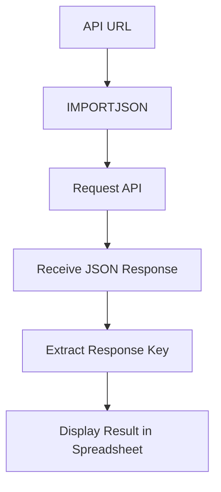

# IMPORTJSON Custom Function

## Formula

```gs id="p7xt4m"
=IMPORTJSON(alamat_api, Keyrespons)
````

## Deskripsi

`IMPORTJSON` adalah custom function pada Google Sheets yang digunakan untuk mengambil data JSON dari API atau URL tertentu lalu menampilkannya langsung ke spreadsheet.

Function ini bukan formula bawaan Google Sheets dan biasanya dibuat menggunakan:

* Google Apps Script
* Script library tambahan
* Custom integration

Formula ini umum digunakan untuk:

* Integrasi REST API
* Mengambil data realtime
* Dashboard monitoring
* Sinkronisasi data external
* Otomatisasi reporting

---

# Struktur Formula



---

# Penjelasan Parameter

## 1. alamat_api

```gs id="u3qp9k"
alamat_api
```

Berisi URL endpoint API yang akan dipanggil.

Contoh:

```text id="x5rn7m"
https://api.example.com/users
```

Fungsi parameter ini:

* Menentukan sumber data
* Mengirim request ke server API
* Mengambil response JSON

---

## 2. Keyrespons

```gs id="g2wf8x"
Keyrespons
```

Digunakan untuk menentukan key atau path JSON yang ingin diambil dari response API.

Contoh response JSON:

```json id="b4tm6v"
{
  "name": "Akmad",
  "email": "akmad@mail.com"
}
```

Contoh penggunaan:

```gs id="n6zx3p"
=IMPORTJSON(api_url, "name")
```

Hasil:

```text id="s8vr2q"
Akmad
```

Jika kamu ingin mengambil semua data response maka gunakan ini :

Contoh response json:

```json id="h3pw9m"
{
  "data": {
    "name": "Akmad",
    "email": "akmad@mail.com"
  }
}
```
Contoh menggunakan:

```gs id="f8zn4qx"
=IMPORTJSON(api_url, "data")
```

Hasilnya :

| name  | email   |
| ----  | --- |
| akmad | akmad@mail.com  |
| hamsyani | hamsyani@mail.com  |
| nudin  | nudin@mail.com |


---

# Cara Kerja Formula

```text id="q9mk4w"
Kirim request ke API
        ↓
Terima response JSON
        ↓
Cari key yang diminta
        ↓
Ambil value dari key tersebut
        ↓
Tampilkan hasil ke spreadsheet
```

---

# Contoh Penggunaan

## Formula

```gs id="d5pw7n"
=IMPORTJSON(
"https://api.example.com/users",
"name"
)
```

---

## Response API

```json id="z7rk2m"
{
  "name": "Akmad",
  "role": "Backend Developer"
}
```

---

## Result

| name  |
| ----- |
| Akmad |

---

# Use Case

Formula ini sering digunakan untuk:

* Dashboard API monitoring
* Tracking data realtime
* Integrasi ERP
* Integrasi inventory system
* Menampilkan data external otomatis
* Fetching JSON data

---

# Catatan

Karena `IMPORTJSON` merupakan custom function, maka:

* Membutuhkan Google Apps Script
* Bisa terkena limit quota API
* Membutuhkan akses internet
* Bergantung pada struktur JSON API

---

# Kesimpulan

`IMPORTJSON` digunakan untuk mengambil data JSON dari API secara langsung ke Google Sheets menggunakan custom function.

Sangat cocok digunakan untuk:

* Integrasi API
* Data automation
* Realtime spreadsheet
* Monitoring dashboard
* External system integration
