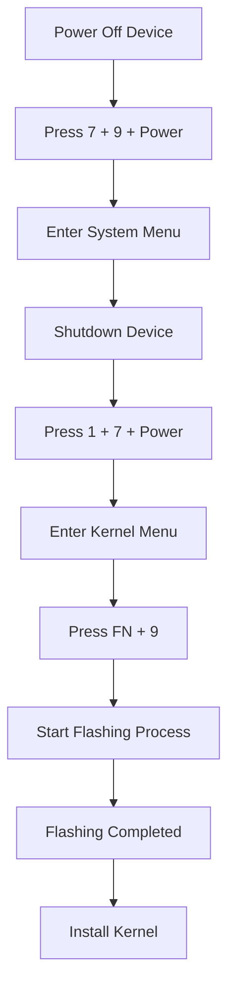

# Flash Firmware Chiperlab

Flash Firmware Chiperlab adalah proses pembaruan atau instalasi ulang sistem perangkat pada terminal barcode scanner dan mobile computer Chiperlab untuk meningkatkan performa, memperbaiki bug, serta memastikan kompatibilitas dengan aplikasi terbaru.

Melalui proses flashing firmware, perangkat dapat dikembalikan ke kondisi stabil ketika mengalami error sistem, bootloop, hang, atau kegagalan aplikasi. Pembaruan firmware juga membantu meningkatkan keamanan perangkat dan optimalisasi fungsi hardware seperti scanner, touchscreen, konektivitas Wi-Fi, hingga komunikasi data.

Layanan Flash Firmware Chiperlab umumnya mencakup:

* Install ulang firmware resmi
* Upgrade versi sistem
* Perbaikan gagal booting
* Unlock error sistem
* Recovery perangkat mati software
* Optimasi performa perangkat

## Download Peralatan Yang dibutuhkan

- Driver Chiperlab khusus windows 
  [Download disini](https://drive.google.com/file/d/1N-9qJW6OMTJN8w6vXC8KT44bqfq29Ulz/view?usp=sharing)

- Download Forge  chiperlab
  [Download disini](https://drive.google.com/file/d/1Kt2pgaTtyHzdvPWybJPLXI7dwe6p7aor/view?usp=sharing)

- Software Flashing
  [Download disini](https://drive.google.com/file/d/1Q6y-DcIwlXO6x_k22oGCasGV6UPP0cbg/view?usp=sharing)

- Firmware,Boot,Kernel 
  [Download disini](https://drive.google.com/file/d/1Jy_ZPHn6dbTATGqCJumiBzzHyzN2WD0-/view?usp=sharing)

- Setup module
  [Download disini](https://drive.google.com/file/d/1qwLYgzH5hVv_OhP9_o1zJrBdJnJ6CBrg/view?usp=sharing)


## Langkah - langkah Melakukan Flashing.

Sebelum Memulai melakukan proses flashing, pastikan bahwa:

- Baterai pengkat terisi secara mencukupi.
- Driver USB Docking telah terpasang dengan benar..
- Semua firmware dan alat flashing telah diunduh..
- kabel USB Docking terkoneksi dengan stabil.

### Tahapan Flashing

1. matikan terlebih dahulu, tekan **power**.

2. Nyalakan perangkat sambil menekan kombinasi tombol berikut secara bersamaan:
   ```text 
   7+9+power
   ```

3. Setelah **Menu Sistem** muncul, tekan tombol **Power** lagi hingga perangkat mati.

4. Nyalakan kembali perangkat sambil menekan 
   ```text
   1 + 7 + power
   ```

5. pada kernel menu, tekan 
   ```text
   fn + 9
   ```

6. Proses flashing firmware akan dimulai secara otomatis..

7. Tunggu hingga proses flashing selesai dengan sukses.
   
8. Lanjutkan dengan menginstal paket kernel yang dibutuhkan.

## Flashing Workflow



## Catatan

* Mengganggu instalasi firmware dapat menyebabkan kerusakan sistem.

* Selalu gunakan versi firmware yang sesuai dengan model perangkat Chiperlab U8000.

* Disarankan untuk mencadangkan data penting sebelum melakukan pembaruan firmware.