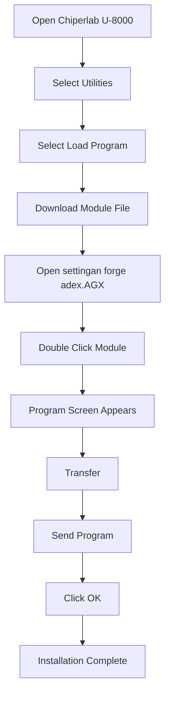

## Module

adalah bahan untuk perangkat chiperlab, agar automatis enter ketika kita scan barcode, sehingga tidak perlu memakai qty terlebih dahulu.

## Instalasi Modul
>sebelum melakukan ini pastikan anda sudah mengintall software ini diperangkat komputer anda

```text
Forge Batch 8 Series Install_2.02.0007.exe
```

## Installation Flow



1. Pada perangkat Chiperlab U-8000 pilih :
  
  ```text
  Utilities
  ```
2. Pilih `Load Program`

3. Buka Module, Pastikan sudah mendownload modulenya, module bernama :
```text
settingan forge adex.AGX
```
4. Double click pada module tersebut.

5. Tunggu hingga Menampilkan layar program.

6. pilih Transfer :
  -> Send Program.

8. OK dan selesai