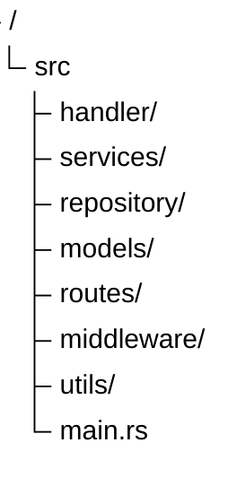

```md id="0l7dwp"
```

## Pendauluan Axum

Axum adalah web framework asynchronous untuk Rust yang dibangun di atas ecosystem Tokio dan Hyper.

Axum dirancang untuk membuat REST API dan backend service dengan performa tinggi, type safety kuat, dan arsitektur modular.

Framework ini banyak digunakan untuk:

- REST API
- Authentication service
- Realtime service
- Microservice
- Backend application

## Keunggulan Axum

- Built-in async/await
- Type-safe routing
- Middleware support
- Extractor system yang fleksibel
- Integrasi kuat dengan Tokio
- Cocok untuk high concurrency application

## Instalasi

Tambahkan dependency pada `Cargo.toml`:

```toml
[dependencies]
axum = "0.8"
tokio = { version = "1", features = ["full"] }
```

## Dasar Routing

Contoh API sederhana menggunakan Axum:

```rust
use axum::{
    routing::get,
    Router,
};

async fn root() -> &'static str {
    "Hello Axum"
}

#[tokio::main]
async fn main() {
    let app = Router::new()
        .route("/", get(root));

    let listener = tokio::net::TcpListener::bind("0.0.0.0:3000")
        .await
        .unwrap();

    axum::serve(listener, app)
        .await
        .unwrap();
}
```

### Menjalankan Proyek

```rust
cargo run
```

### Server akan berjalan di

```bash
localhost:3000
```

## Struktur Backend Axum

Umumnya project Axum dipisahkan menjadi beberapa layer:



## Axum dan Tokio

### Axum menggunakan Tokio sebagai asynchronous runtime

#### Dengan Tokio, Axum mampu menangani banyak request secara concurrent tanpa membuat thread baru untuk setiap request

Hal ini membuat Axum sangat cocok untuk:

- API high traffic
- WebSocket
- Realtime notification
- Background task
- Concurrent processing
- Use Case

Axum cocok digunakan untuk:

- Inventory system
- POS backend
- Payment gateway
- Authentication API
- ERP backend
- Realtime dashboard
- WebSocket service

Karena performa dan type safety yang tinggi, Axum menjadi salah satu framework backend modern yang semakin populer di ecosystem Rust.

> sumber code [Axum Documentation](https://docs.rs/axum/latest/axum/)
